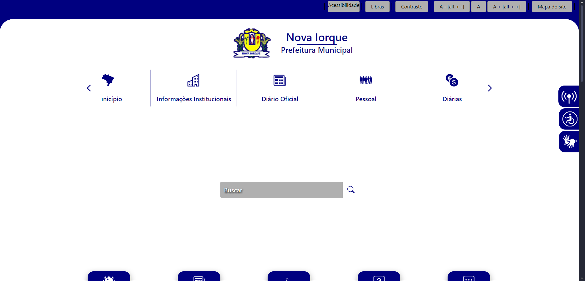

# Metas de Usabilidade

## Introdução

Este documento define critérios essenciais de usabilidade, que são fundamentais para orientar as prioridades no design de produtos. Ele também detalha o processo de avaliação que será implementado durante o desenvolvimento do projeto relacionado ao site da prefeitura municipal de Nova Iorque, estabelecendo quais padrões são aceitáveis e quais não são. A usabilidade é medida pela capacidade de usuários específicos alcançarem objetivos em contextos determinados com eficácia, eficiência e satisfação.

[1](../analise-de-requisitosII/metasUsabilidade.md#referências-bibliográficas)A utilização das metas de usabilidade durante o projeto ajuda a solucionar preocupações como a produtividade do usuário durante a utilização do sistema e motivação desse usuário para um aprendizado eficaz. Para atingir os padrões de usabilidade estabelecidos, seguiremos as 6 metas de usabilidade definidas por Jakob Nielsen. As metas incluem[2](../analise-de-requisitosII/metasUsabilidade.md#referências-bibliográficas): 

- <strong>Aprendizagem:</strong> referente à facilidade de aprendizado do sistema. O objetivo é que o usuário consiga aprender a utilizar o sistema rapidamente e se torne competente na realização das tarefas; 
- <strong>Eficiência:</strong> forma como o sistema ajuda o usuário a realizar determinadas atividades de desejo do usuário. E se o caminho realizado para determinada atividade possui a menor quantidade de etapas possível;
- <strong>Eficácia:</strong> capacidade do produto em desempenhar efetivamente as funções esperadas, ou seja, se ele é eficaz em cumprir o propósito para o qual foi projetado.
- <strong>Memorização:</strong> é a capacidade do usuário de lembrar como se utiliza o sistema após já ter aprendido a usá-lo. Quando se tem um sistema que não requisitado com frequência é essecial que o usuário se lembre como utilizá-lo;
- <strong>Segurança:</strong> diz respeito a proteção do usuário de condições perigosas e situações indesejáveis, por exemplo, prevenir que o usuário cometa erros graves e no caso do acontecimento, o sistema deve ter maneiras do usuário recuperar ou desfazer;
- <strong>Utilidade:</strong> são as  medidas e funcionalidades concedidas ao usuário para realização da atividade de interesse.

## Metodologia

Cada meta será avaliada detalhadamente definindo quais possuem uma implementação problemática e que deverão ser priorizadas no projeto. Nesse sentido, será feita a simulação do comportamento dos usuários durante o uso do site baseando-se no [perfil do usuário](../analise-de-requisitos/perfilDeUsuario.md) coletado anteriormente. Isso nos permitirá avaliar como cada uma das metas está sendo incorporada ao site. 

Além disso, durante a avaliação, cada meta possuirá uma <strong>pergunta chave</strong> que servirá de base para a avaliação daquela meta em específico. Como resultado, as metas serão classificadas com base em seu cumprimento pelo site, determinando quais foram alcançadas e quais não.

## Das metas utilizadas

### Aprendizagem

<strong>Pergunta Chave:</strong> O site é fácil de aprender?

<strong>Avaliação:</strong> De modo geral, o site possui um certo nível de dificuldade para ser aprendido. A navegação é contra intuitiva, tendo muitas informações na página inicial que não justificam uma tarefa específica. Além disso, também na página inicial, é utilizado um carousel que acaba ofuscando funcionalidades importantes do site, como acesso ao cidadão, como cidadão ou funcionário, e até mesmo avisos e licitações que se encontram ao final da página inicial. Assim, para que a meta de aprendizagem seja satisfeita, é necessário reorganizar os componentes do site de modo que fiquem visíveis e sejam autoexplicativos.

<strong>Figura 1:</strong> Página inicial do site

 

### Eficiência

<strong>Pergunta Chave:</strong> O site ajuda o usuário a realizar as tarefas de forma eficiente?

<strong>Avaliação:</strong> Como mencionado na meta de aprendizagem, muitas tarefas são ofuscadas pela organização do site ser mal formulada. A eficiência do site é prejudicada pela falta de organização e clareza das informações. Dessa forma, até usuários mais experientes precisarão gastar um esforço adicional para realizar determinadas tarefas. A seção [análise de tarefas](../analise-de-requisitos/analiseTarefas.md) detalha algumas dessas tarefas que são prejudicadas pela falta de eficiência do site. Para que essa meta seja satisfeita, e consequentemente a de aprendizagem, é necessário reorganizar o site de modo que as informações sejam claras e acessíveis.

### Eficácia

<strong>Pergunta Chave:</strong> O site faz o que se espera que ele faça?

<strong>Avaliação:</strong> O site apresenta uma eficácia moderada tendendo para baixa. A organização do site é o principal fator que afeta a meta de eficácia, pois exige um esforço maior do usuário para a realização de tarefas, mas que é possível realizá-las sem grandes problemas. No entanto, a eficácia do site poderia ser melhorada com a reorganização das informações e a simplificação da navegação.

### Memorização

### Segurança

### Utilidade

## Referências Bibliográficas

> 1 - Diana Fournier. As 6 metas de Usabilidade. MEDIUM, 2016. Disponível em: https://medium.com/vivareal-ux-chapter/as-6-metas-de-usabilidade-9491442fd56a. Acesso em: 02 de dezembro de 2024.

> 2 - Metas de Usabilidade Banco Central. Disponível em: [2023.1-BancoCentral](https://interacao-humano-computador.github.io/2023.1-BancoCentral/#/analise_requisitos/metas_usabilidade). Acesso em: 02 de dezembro de 2024.

## Bibliografia

## Histórico de Versão
---
| Versão | Data | Autor(es) | Descrição | Data de Revisão | Revisor(es) |
|:---:|:---:|---|---|:---:|---|
| 1.0 | 02/12/2024 | [Paulo Henrique](https://github.com/paulomh) | criação do documento | 02/12/2024 | [Weverton Rodrigues](https://github.com/vevetin) |