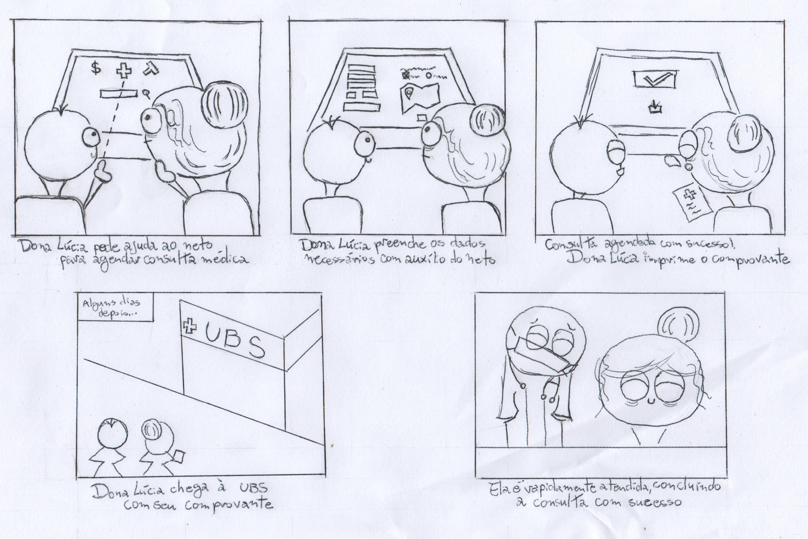

# Storyboards

## Introdução

O storyboard é uma técnica de prototipação de baixa fidelidade amplamente utilizada no design de interação para representar visualmente o fluxo de tarefas ou interações de usuários com um sistema. Segundo Rogers, Sharp e Preece (2013)[1](../nivel01/storyboards.md#referências-bibliográficas), trata-se de uma série de desenhos ou cenas que ilustram como um usuário pode realizar uma tarefa com o produto em desenvolvimento. Vianna et al. (2012)[2](../nivel01/storyboards.md#referências-bibliográficas) complementam ao definir o storyboard como uma representação visual de uma história, útil para comunicar ideias ou detectar lacunas no produto ou serviço.

No contexto deste trabalho, os storyboards foram elaborados para visualizar cenários de uso identificados durante a análise de tarefas (HTA e GOMS). Cada storyboard representa uma sequência lógica de interações, com o objetivo de identificar pontos de melhoria no design da interface e na experiência do usuário.

### Storyboard 1 - Fazer um pedido no e-SIC:

O Storyboard abaixo mostra o ator João Ricardo, professor da rede municipal de ensino do município de Nova Iorque, inicialmente na escola, preocupado com os repasses financeiros para a educação daquele ano. Sabendo da transparência que o site da prefeitura fornece, João decide ir para casa e investigar utilizando o “e-SIC” presente no site, que da direito ao cidadão pedir informações de cunho governamental. Basicamente, João precisa ter acesso a um computador com internet e, logo em seguida, acessar o site da prefeitura e navegar até a aba do “e-SIC”. Feito esses passos iniciais e na página inicial do “e-SIC”, ele clica para fazer um “pedido anônimo”, pois ele não quer se identificar para manter sua privacidade. João é redirecionado para outra página contendo um formulário de preenchimento. João preenche o formulário com seus questionamentos e clica em “cadastrar”, finalizando sua tarefa e aguardando o retorno por parte da prefeitura.

<b>Figura 1</b> - Storyboard: fazer um pedido no e-SIC

Autor: [Paulo Henrique](https://github.com/paulomh)

### Storyboard 2 - Agendamento de Consulta Médica para Dona Lúcia:

Dona Lúcia, uma senhora com baixa familiaridade tecnológica, decidiu agendar sua consulta médica online para evitar filas e dificuldades administrativas. Com o auxílio do neto, acessou o site da prefeitura em sua residência, localizou a seção de agendamentos, preencheu o formulário com os dados necessários e imprimiu o comprovante. No dia da consulta, foi atendida na UBS de forma prática e sem complicações, o que trouxe alívio e confiança para futuras utilizações do sistema, motivada pela conveniência e pela melhoria no acesso aos serviços de saúde.

<b>Figura 2</b> - Storyboard: Agendamento de Consulta Médica para Dona Lúcia

Autor: [Weverton Rodrigues](https://github.com/vevetin)

### Storyboard 3:

### Storyboard 4:

### Storyboard 5:

## Referências Bibliográficas
> \- ROGERS, Yvonne; SHARP, Helen; PREECE, Jenny. Design de Interação: Além da Interação Humano-Computador. Tradução de Isabela Gasparini. 3. ed. Porto Alegre: Bookman, 2013.

> \- VIANNA, Maurício; VIANNA, Ysmar; ADLER, Isabel K.; LUCENA, Brenda; RUSSO, Beatriz. Design Thinking: Inovação em negócios. 1. ed. Rio de Janeiro: MJV Press, 2012.

## Histórico de Versão

| Versão | Data | Autor(es) | Descrição | Data de Revisão | Revisor(es) |
|:---:|:---:|---|---|:---:|---|
| 1.0 | 08/12/2024 | [Weverton Rodrigues](https://github.com/vevetin) | criação do documento | 10/12/2024 | [Paulo Henrique](https://github.com/paulomh) |
| 1.1 | 10/12/2024 | [Paulo Henrique](https://github.com/paulomh) | adição do storyboard 1 | 10/12/2024 | [Weverton Rodrigues](https://github.com/vevetin) |
| 1.2 | 10/12/2024 | [Weverton Rodrigues](https://github.com/vevetin) | adição do storyboard 2 | |  |