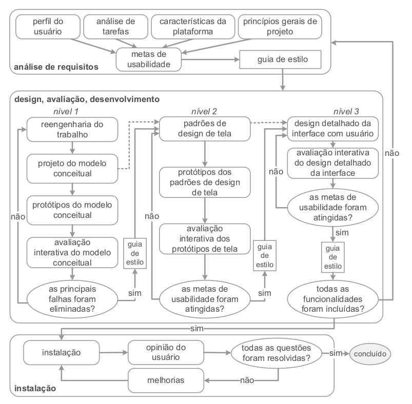

# Processo de Design

## Introdução

O design pode ser definido de forma básica como um processo com três atividades: Análise da situação atual,
a síntese de uma intervenção e a avaliação da nova situação. Cada uma delas com suas maneiras e ordens de
serem serem executadas durante o processo de forma iterativa, permitindo um aprimoramento constante dos artefatos.

## Engenharia de Usabilidade de Mayhew

O processo de design escolhido pela equipe se trata da Engenharia de Usabilidade de Mayhew, que é dividido em três etapas, sendo elas:
Análise de requisitos, Design, Avaliação, Desenvolvimento e Instalação. A escolha deste processo deve-se ao seu ciclo de execução
ser completo e abranger diversos detalhes que podem auxiliar a equipe com o planejamento e execução do projeto. No nosso caso,
apenas a etapa de instalação será utilizada, visto que as etapas anteriores são melhores aplicadas em sistemas que estão sendo desenvolvidos
e assim, não pertencendo ao escopo da disciplina de IHC onde trabalharemos em um site já construído.

 
<small>(Capítulo 6, ítem 6.3.3, Figura 6.7, página 106, Interação Humano-Computador e Experiência do Usuário, Simone Barbosa e Bruno Santana)</small>

## Bibliografia

> \- Processos de Design de IHC Capítulo 6, Interação Humano-Computador e Experiência do Usuário, Simone Barbosa e Bruno Santana

## Histórico de Versão

---

| Versão |    Data    | Autor(es)                                        | Descrição                | Data de Revisão | Revisor(es) |
| :----: | :--------: | ------------------------------------------------ | ------------------------ | :-------------: | ----------- |
|  1.0   | 07/11/2024 | [Rodrigo Wendrel](https://github.com/rodwendrel) | Criação do documento     |                 |             |
